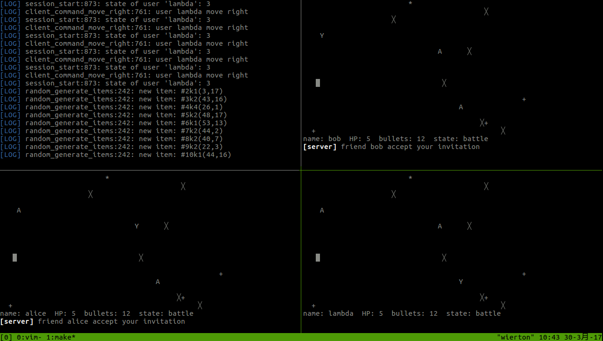

# naive net-based multi-user shooting game

* run the game
  1. `make && ./server`
  2. run `./client` in another terminal

* instructions
  1. use w s a d to switch selected button.
  2. type `<TAB>` to enter command mode.
	* type `help --list` for all available commands
	* type `help command` for further information of this command
  3. character in battle

	|  character  |  meaning  |
	|-------------|-----------|
	|      Y      |    you    |
	|      A      |   others  |
	|      █      |   grass   |
	|      ╳      |   magma   |
	|      +      |  magazine |
	|      *      | blood vial|
  4. operations in battle
    * w s a d can move around
	* space can fire
  5. quit the battle
    * note that even you die, you won't be quited from the battle
	but your role will be changed from player into witness. If you
	want to return the last ui, you need to type `q`.

* screenshots

